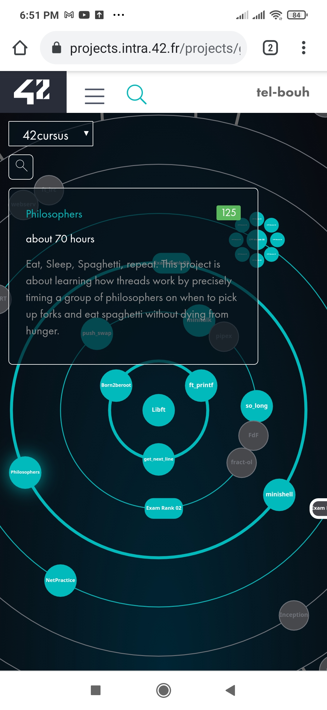

# Philosophers:  project in 42 cursus.

## Overview

This project is about learn the basics of threading a process.
Create threads and use mutexes.

### The project

• Each philosopher should be a thread.
• There is one fork between each pair of philosophers. Therefore, if there are several
philosophers, each philosopher has a fork on their left side and a fork on their right
side. If there is only one philosopher, there should be only one fork on the table.
• To prevent philosophers from duplicating forks, you should protect the forks state
with a mutex for each of them.

### Screenshot

